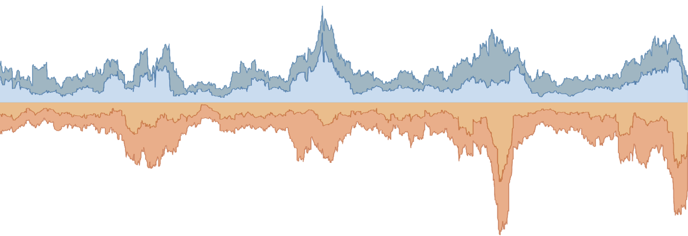
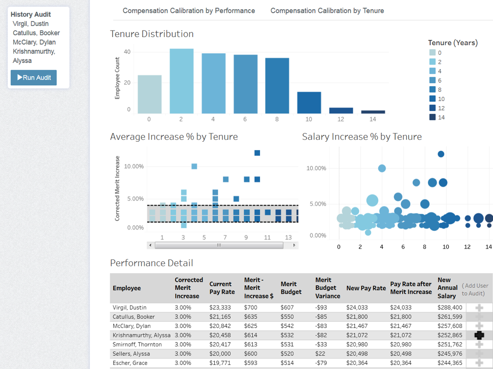

# Tableau Embedded Analytics Playbook 

[Tableau](https://www.tableau.com) is the world's leading end-to-end data and analytics platform. 


Leverage the analytical powerhouse of Tableau to analyze and visualize data. This Playbook teaches you how to compose Tableau's varied [product capabilities](https://www.tableau.com/products/our-platform) into applications that thrill customers, coworkers and friends!

Beyond creating visual representations of data, Tableau provides the greatest benefits as it helps people discover what information is valuable to others. It enables users to analyze data and build the interfaces that represent 
them with unmatched speed and flexibility resulting in a springboarding of ideas into value.


To get started, go to the [Tableau Embedded Analytics Playbook](https://tab-se.github.io/embedding_playbook).

<br/>

## Local Development

First, clone this GitHub repository using your [method of choice](https://docs.github.com/en/repositories/creating-and-managing-repositories/cloning-a-repository).

Then, navigate to the directory where you cloned the repository using your shell.

```sh
cd embedding_playbook
```

Install dependencies (look for a file called `package.json`).
```sh
npm i
```

Finally, start the development server.
```sh
npm run dev
```

Visit `localhost:3000` to see the app. Enjoy!

>NOTE: Development on GitHub codespaces may differ from this process. Please refer to their documentation for further guidance.



## About the Playbook

The Playbook was created with [Nextra](https://nextra.site), a documentation template built with the [Nextjs](https://nextjs.org/) web framework that uses [React](https://react.org/) to generate cutting-edge static webapps while content is written in [Markdown](https://www.markdownguide.org/getting-started/), an industry standard language for documentation. The app can be hosted on [Nextjs](https://vercel.com/solutions/nextjs?utm_source=next-site&utm_medium=banner&utm_campaign=home), [GitHub Pages](https://pages.github.com/) and other [static hosts](https://nextjs.org/docs/pages/building-your-application/deploying/static-exports#deploying).

This architecture was selected for the following reasons:
1. [React](https://react.org/) is great for creating dynamic UI elements such as Tableau embeds that fit seamlessly within product documentation. It's popularity makes it easier to find developers who can contribute to the codebase or teach others how to do so. [Nextjs](https://nextjs.org/) is the most popular React metaframework known for some of the [highest rated](https://2022.stateofjs.com/en-US/libraries/front-end-frameworks/#ratios-over-time) developer experiences out there.
2. [Markdown](https://www.markdownguide.org/getting-started/) is a commonly used lightweight markup language that allows technical writers to produce content within a "[docs-as-code](https://www.writethedocs.org/guide/docs-as-code/)" framework. This is an established method for application developers and technical writers to work in the most agile way possible with no overhead expenses. It is also the established process for writing technical documentation within this organization.
3. [Jamstack](https://jamstack.org/glossary/jamstack/) is the architectural approach that encompasses [SSG](https://jamstack.org/glossary/ssg/) (static site generation) which allows for the generation of complex and dynamic websites through 'builds' which result in a static app that can be hosted freely or inexpensively on some of the fastest web infrastructure, [CDNs](https://jamstack.org/glossary/cdn/).

The combination works great for this use case since it is built to facilitate contributions towards content that fulfill the purpose of this Playbook while still allowing developers to write a dynamic application with cutting-edge best practices for the web. 

Most technical documentation required to configure, alter or enhance this codebase is updated and maintained by professional teams listed here (in order of importance):

1. [Nextra](https://nextra.site) (docs theme)
2. [Nextjs](https://nextjs.org/) (framework)
3. [React](https://react.org/) (UI library)

</br>

## Embedding Tableau

Embedding in the Playbook relies on importing a reusable UI component into an article that ends with `.mdx` as it designates the file as using a [superset of markdown](https://mdxjs.com/) that supports React components. To accomplish this, do the following:

1. Make sure the article ends in `.mdx` rather than `.md` which does not support React.
2. Import the `<Tableau/>` component into the article and provide configuration options as shown here:

```md
import { TableauViz } from '../../components';

# Embedding Tableau Views

This is generic markdown content preceding the Tableau component of interest

<Tableau
  src='https://public.tableau.com/views/{viz}'
  height='900'
  width='700'
  hideTabs='true'
  device='default'
/>
```



</br>

## Contributing

Contributions to this project are more than welcome and may come in the form of enhancements to the codebase, writing articles, correcting or identifying bugs or even suggesting improvements.

For more information please refer to the [Contribution Guide](./CONTRIBUTING.md).


## License

This project is licensed under the [MIT License](LICENSE).


