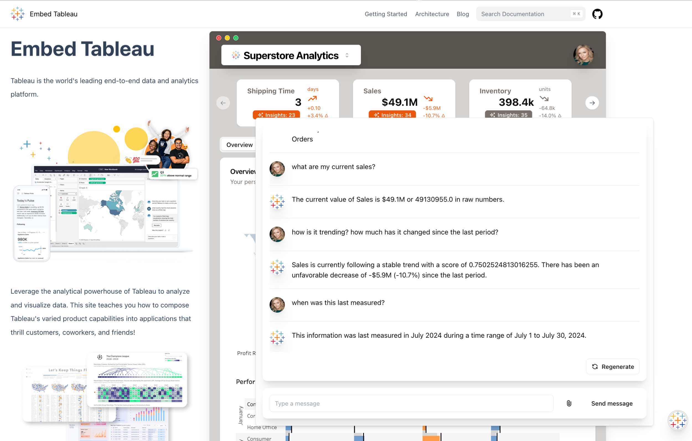

# Embed Tableau 

[Tableau](https://www.tableau.com) is the world's leading end-to-end data and analytics platform. 


Leverage the analytical powerhouse of Tableau to analyze and visualize data. This guide teaches you how to compose Tableau's varied [product capabilities](https://www.tableau.com/products/our-platform) into applications that thrill customers, coworkers and friends!

Beyond creating visual representations of data, Tableau provides the greatest benefits as it helps people discover what information is valuable to others. It enables users to analyze data and build the interfaces that represent 
them with unmatched speed and flexibility resulting in a springboarding of ideas into value.



To see the live app go to [Embed Tableau](https://embedding-playbook.vercel.app/).

<br/>

## Quick Start

1. First, clone this GitHub repository using your [method of choice](https://docs.github.com/en/repositories/creating-and-managing-repositories/cloning-a-repository).

2. Then, navigate to the directory where you cloned the repository using your shell.
```sh
cd embedding_playbook
```

3. Install dependencies (look for a file called `package.json` for more details).
```sh
npm install
```

4. Create a local environment file by copying the provided template.
```sh
# copy the development template
cp ./.env.development ./.env.development.local
```

5. Provide values for all environment variables listed in `.env.development.local`.

6. Finally, start the development server (see [USAGE.md](docs/USAGE.md) for more shell scripts).
```sh
npm run dev
```

1. From this point forward, any changes made to files in the codebase will be previewed live in development mode, noticeable in particular will be changes to React components (`.jsx` files) or Markdown articles (`.mdx` or `.md` files). 

Visit `localhost:3000` to see the app. Enjoy!

For more detailed installation instructions refer to [INSTALLATION.md](./docs/INSTALLATION.md) to learn about production deployments.

To learn more about developer scripts that run this application go to [USAGE.md](docs/USAGE.md).

>NOTE: Development on GitHub codespaces may differ from this process. Please refer to their documentation for further guidance.


## Adding Content

Contributing to new or existing articles is done by editing `.mdx` files located in the `pages/` folder. The folder structure of `pages/` dictates the overall layout of the application which can be further customized via `_meta.json` files placed inside each folder. This architecture is designed and maintained by [Nextra which documents](https://nextra.site/docs/docs-theme/page-configuration) all available options for organizing content.

Refer to this guide for help with [Markdown Syntax](https://www.markdownguide.org/) such as tables, quotes and more. These provide the basics elements that make up the Markdown language.

To embed a Tableau visualization you must first import the `<TableauViz>` component into the `.mdx` article that you are writing and provide the attributes that it needs to display your analytics.

```md
import { TableauViz } from 'components';

# Embedding Tableau Visualizations

This is *generic* markdown content preceding the **Tableau** component of interest.
[Link Text](URL) 

Notice the following attributes provided for a visualization
hosted for free on Tableau Public:

<TableauViz
  src='https://public.tableau.com/views/{viz}'
  height='900'
  width='700'
  hideTabs='true'
  device='default'
  isPublic
/>

Another block of text and an *image* can go after the embed.

```

For more information on writing articles, adding images and displaying interactive components such as a Tableau visualization refer to [STYLE_GUIDE.md](/docs/STYLE_GUIDE.md).

## About

This application follows a "[docs-as-code](https://www.writethedocs.org/guide/docs-as-code/)" model of development  incorporating a powerful UI framework which interfaces with Markdown as the language of content, this helps developers 
and analysts collaborate with the community at-large and more importantly to keep up with the pace of change.

For more information describing the overall architecture of this application as well as it's purpose and inspiration refer to [ABOUT.md](/docs/ABOUT.md).

## Contributing

Contributions to this project are more than welcome and may come in the form of enhancements to the codebase, writing articles, correcting or identifying bugs or even suggesting improvements.

For more information please refer to the [CONTRIBUTING.md](./CONTRIBUTING.md).

## License

This project is licensed under the [MIT License](LICENSE).


