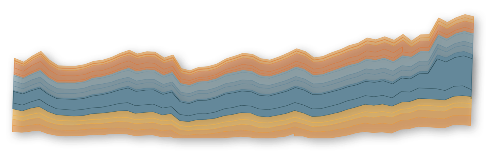

# Embed Tableau 

[Tableau](https://www.tableau.com) is the world's leading end-to-end data and analytics platform. 

## Contributing

Contributions to this project are more than welcome and may come in the form of enhancements to the codebase, writing articles, correcting or identifying bugs or even suggesting improvements.

This project has two separate contribution models, one designed for writing articles and the other intended for maintaining the codebase. [ABOUT.md](./ABOUT.md) explains how the architecture chosen for this app enables a twin contribution model.

Most contributions will come in the form of articles. Writing high-quality guidance for embedding Tableau is the main purpose of this project.

## Writing Content

For detailed instructions on how to write content, how to add images and how to display interactive UI components in this app, refer to [STYLE_GUIDE.md](/docs/STYLE_GUIDE.md).

## Developers

To contribute to the codebase of this application.