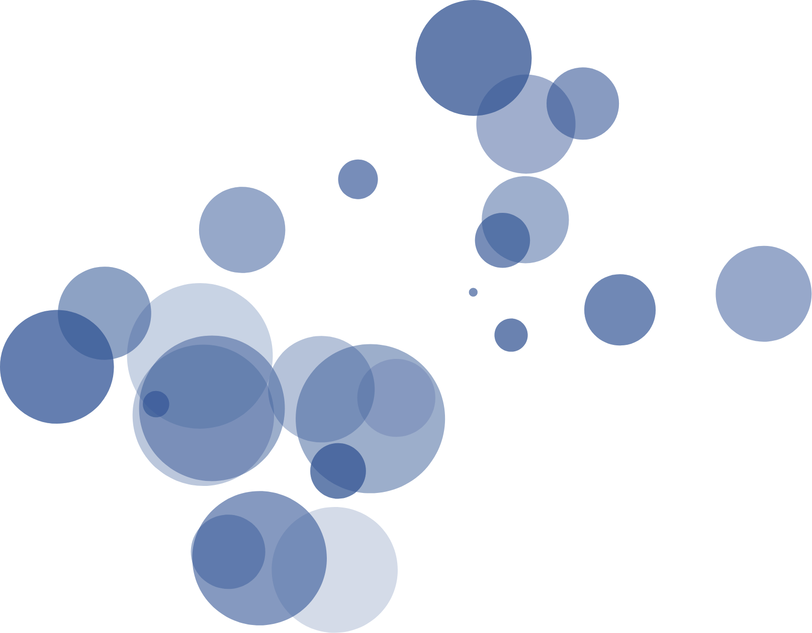

# Demos

You are welcome customize this app and use it to conduct demonstrations of embedded analytics using Tableau. In other words, you can modify the styles and content of the app so it matches your own brand standard and portrays the analytics use case you have in mind.



Customizing Embedded Tableau demos in this app requires working with 2 layers:

1. **Application Layer**: the foundational framework called Nextra provides a configurable "wrapper" combining UI elements with navigation, routing, search indexing and more. This first layer provides a lot of out-of-the-box functionality and relies entirely on local files (databases or dedicated servers are optional) which makes it particularly lightweight and nimble.

    For more details on Nextra, refer to their [official documentation](https://nextra.site/) and the [ABOUT.md](/docs/ABOUT.md) article.

2. **Demo Layer**: since [EmbedTableau.com](https://embedtableau.com) is intended for more uses than just a demo, the initial first layer is designed to support an infinite variety of UIs and use cases. These different interfaces can be defined as reusable UI components that can occupy an entire page or only inhabit portions of it.

    To start, this application provides the `<Demo>` React component which presents Tableau Pulse Metrics and Tableau dashboard embeds. This component uses `<Themes>` to swap between different pages of the demo and defines what each page should look like.


In order to build a custom implementation, you will need to understand and work with the following configurations:

## Application Layer

### `theme.config.tsx`

The file called `theme.config.tsx` is a Nextra configuration that controls the foundational **Application Layer**. `theme.config.tsx` has a reference page on [Nextra's documentation](https://nextra.site/docs/docs-theme/theme-configuration) outlining how it controls navigation items such as the logo, search, github link, the footer, sidebar, table of contents, etc. Note that "Theme Color" or `primaryHue` refers to accents and text highlights. There are only 2 background available (white and dark). To modify backgrounds or "application themes" refer to the docs on the [next-themes](https://nextra.site/docs/docs-theme/theme-configuration#dark-mode-and-themes) package.


## Demo Layer

### `settings.js`

The `settings.js` file is meant to be a high-level configuration for the `<Demo>` component.

In particular there is an array for "themes" which translates to pages inside the `<Demo>` component. For example, your demo might include a theme for Sales and a theme for Finance.

By default, `<Demo>` will first load the theme that has the `type: "default"` attribute.

### `users.js`

The `users.js` file is an object mapping user identifiers such as emails to a key such as `A` or `B` such that `[...nextauth].js` can reference this information and combine them credentials stored in `.env.development.local` or `.env.production.local` in order to authenticate the demo user to Tableau for access to content via the Embedding and REST APIs.

### `Themes/`

`Themes/` is a directory organizing different themes that the `<Demo>` component can present to users. Via the "Themes Selector", users can explore the different themes defined as folders inside of `components/Themes/` such as `<Superstore>` or `<Pacifica>`.

Pay attention to the `index.js` file in each folder as it declares what gets exported for use elsewhere such as exporting a "theme" to be used inside of `settings.js` as a default or some other custom type.

Using Superstore as an example:

`Superstore/index.js`

Has `<Tabs>` defaulting to "overview" which maps to the `<TabsTrigger>` with the same value. When users click on a given `<TabsTrigger>` it will display one of the components such as `<Overview>` or `<Customers>`.

```js
import { Tabs, TabsContent, TabsList, TabsTrigger } from "components/ui";

import { Customers } from './Customers';
import { Overview } from './Overview';
import { Product } from './Product';
import { Shipping } from './Shipping';

export const Superstore = () => {
  return (
    <Tabs defaultValue="overview" className="space-y-3">
      <TabsList>
        <TabsTrigger value="overview">
          Overview
        </TabsTrigger>
        <TabsTrigger value="product" >
          Product
        </TabsTrigger>
        <TabsTrigger value="customers" >
          Customers
        </TabsTrigger>
        <TabsTrigger value="shipping" >
          Shipping
        </TabsTrigger>
      </TabsList>
      <section className="min-h-[892px]">
        <Overview />
        <Customers />
        <Product />
        <Shipping />
      </section>
    </Tabs>
  )
}

```

If you look inside of `Overview.jsx` you will see that the `<TabsContent>` component has a `value="overview"` attribute making it the default presentation and react to clicks on the "Overview" tab.

```js
import { Card, CardContent, CardDescription, CardHeader, CardTitle } from "components/ui";
import { Tabs, TabsContent, TabsList, TabsTrigger } from "components/ui";

import { TableauEmbed } from 'components';

export const Overview = () => {
  return (
    <TabsContent value="overview" className="space-y-4">
      <Card className='dark:bg-stone-900'>
        <CardHeader>
          <CardTitle>Overview</CardTitle>
          <CardDescription>
            Your personal digest of eBikes sales in North America
          </CardDescription>
        </CardHeader>
        <CardContent className="flex justify-center pl-2">
          <TableauEmbed
            src='https://prod-useast-b.online.tableau.com/t/embeddingplaybook/views/superstore/overview_800x800'
            width={800}
            height={1000}
            hideTabs={true}
            device='default'
            toolbar='hidden'
            layouts = {{
              '*': { 'device': 'default', 'width': 800, 'height': 1000 }
            }}
          />
        </CardContent>
      </Card>
    </TabsContent>
  )
}
```

Ultimately the number and variety of themes you present in your app is totally up to you. The aim here is to allow you to have full control of a blank canvas so you can paint your analytics dream freely.

## Customizing `<Demo>`

You are also free to modify `<Demo>` as much as you want or even build your own custom UI that do not rely on `<Demo>`. Either way, you will get best results if you adhere to the UI library already used by this application [Shadcn](https://ui.shadcn.com/).

This resource gives you access to:

1. [UI Components](https://ui.shadcn.com/docs/components/accordion)
2. [UI Blocks or full pages](https://ui.shadcn.com/blocks)
3. [Themes](https://ui.shadcn.com/themes)
4. [Colors](https://ui.shadcn.com/colors)

All of the UI components and blocks can be modified using generative AI on [v0](https://v0.dev/) (look for the "edit in v0" button).


With this, you can essentially describe a UI or outcome in natural language, leverage an existing UI block or your own code as a starting point and have the AI generate multiple versions of your request in such a way that you can copy pase the code into this app.

This provides a very efficient way to generate fully custom UIs that can be ported into this app with ease.

To import new shadcn components or to update existing files, refer to the guide in [USAGE.md](/docs/USAGE.md#importing-ui-components-from-shadcn).
